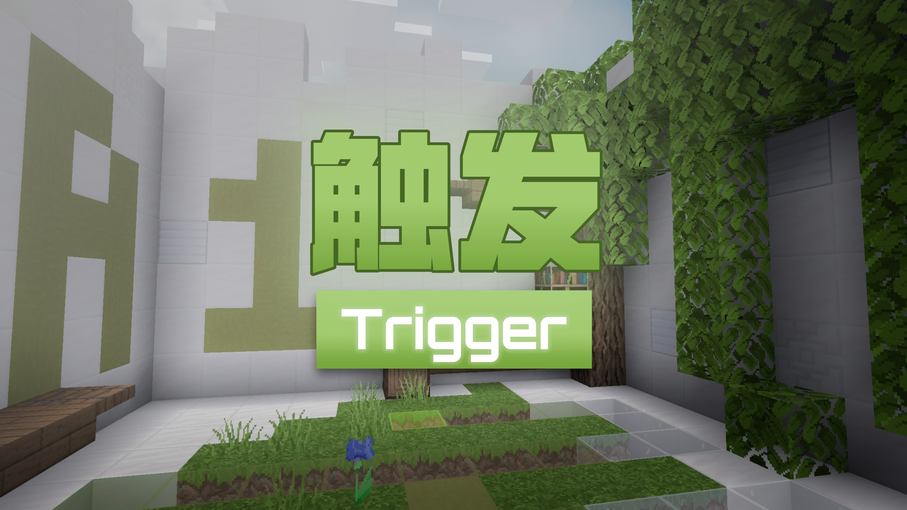
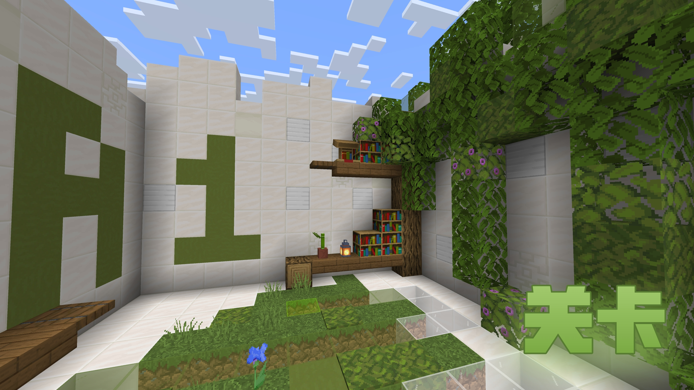
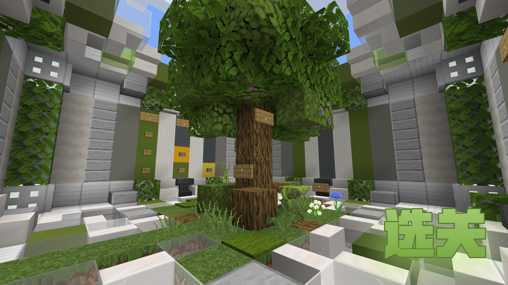
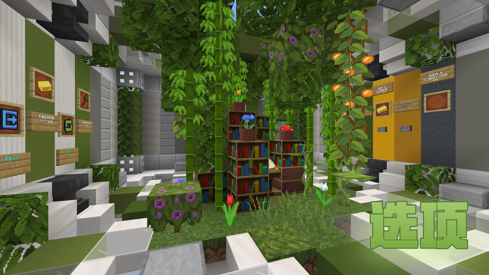
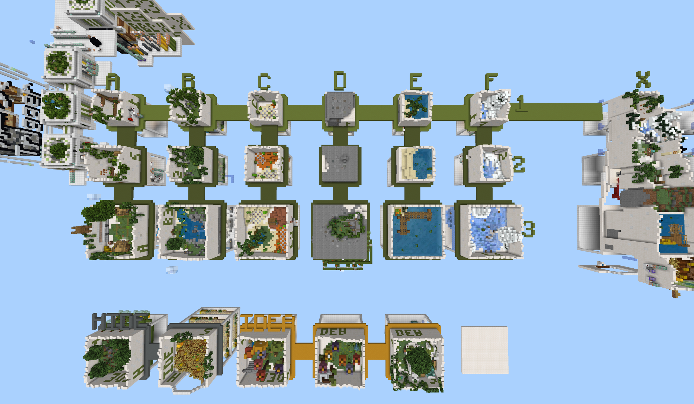

# 

## [EN](./README_EN.md "English") | [ZH_CN](./README.md "简体中文")

## Update Log

I rebuilt the command system with new function architecture, redesigned most Grade 2-3 levels, and added an NPC avatar of the creator. This massive overhaul relaunches the map as a brand-new resource! 

---

## Author's Note

I' m **GreeLeaf**. This map is the third entry in the **[​1 word, 10 worlds]**. The second entry **[​Rotation]** was featured in an event, and the first **[​Hole]** was co-developed. Both will return after optimizations.A tribute to parkour & minigame creator **[​RipplingWheat]**. "I’ll wait here for your return." (Update: Found their contact info in old archives – happy ending unlocked! 🎉)

---

## Credits

Test Crew: **YZBWDLT, PigeonKI, Andy7343, tck1122, lanos212, Ender5207541, Echeng, HuanGuangYC, MohenMH, ProjectXero**
Technical Suports: **YZBWDLT, ProjectXero, 6g3y, WildCrap, bsy**
Thanks for **AB workshop** supports
To playersThanks for downloading! 🥳 Thands for video if you are Youtuber.

---

## Need-to-Knows

Core Gameplay: Progressive Creative Puzzles.

There are 7 mainline levels and 12 side levels.

Levels contain 6 Classes, marked "A"to"F"&"X".
Each Class contains 3 Grade of level.
X = Final boss level (mix of A-F).

Trade Tokens to for IDEA CLASS.
HIDE CLASS just find it.

---

Specs: Medium/high recommended.
Playtime: Speedrun ~40min | Casual ~1.5hr+
Recommend Route: A1-F1 -> Side Levels (A2-F3) -> IDEA Class -> X & HIDE Class
Drop comments if you find issues or have ideas!  Contact

---

## Download

### Disk

_Hover for code_

[123 cloud](https://www.123684.com/s/wIwKTd-kua6d "Code:6Pa7")
[lanzou cloud](https://wwum.lanzoub.com/b0180j3na "Code:Leaf")

### BBS & Platform

- Chinese
  [KLPBBS](https://klpbbs.com/thread-159914-1-1.html)
  [MineBBS](https://www.minebbs.com/resources/11303/)
  [TITAIKE](https://www.titaike.cn/6649.html)
  [Netease Chinese Ver.](https://resource-minecraft.h5.163.com/#/detail?uid=2156009524&id=4678791372825514220) _（搜索地图名：触发+，组件码：2351523）_
- International
  [GitHub](https://github.com/GreeLeaf2580/Trigger)
  [MCPEDL](https://mcpedl.com/trigger/)
  [Planet Minecraft Community](https://www.planetminecraft.com/project/trigger-6600634/)
